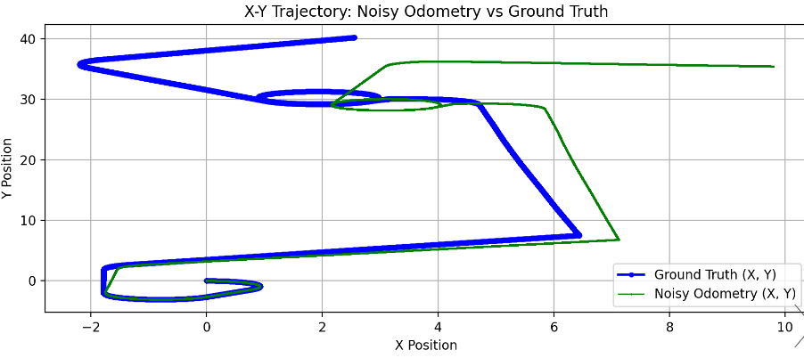

# Differential Drive Plugin with Odometry Drift for Gazebo Fortress

This plugin simulates realistic odometry drift for differential drive robots in Gazebo Fortress. It adds autoregressive noise to wheel velocities, causing drift to accumulate over time, which mimics real-world conditions like wheel slip and misalignment.

## Features

- **Gradual Drift**: Adds cumulative noise to wheel velocities, simulating drift over time.
- **Realistic Dynamics**: Reflects how small errors can build up in real-world robot navigation.

I created this to test my localization and sensor fusion system, thought it might help others as well.
### Some Todo's

- Add bounded drift limits 
- impulsive noise (random jerks)
- lateral drift to simulate external forces.

## How it Looks



The plot above shows a comparison between ground truth and the noisy odometry data, as you can see accumulating drift over time.

## Installation & Usage

1. **Clone the repository**:
   ```bash
   git clone <repository_url>
   cd <repository_name>
2. **Build the plugin**
3. **Set the environment variable**:
   ```bash
    export GZ_SIM_SYSTEM_PLUGIN_PATH=$GZ_SIM_SYSTEM_PLUGIN_PATH:<path_to_plugin_build>
4. **Configure the plugin in your URDF:**:
In your robot’s URDF file, add the plugin configuration. By default, noisy odometry data will be published to the /odom topic. If you also want the ground truth (without noise), set <odom_gt_topic>odom_gt</odom_gt_topic> under the plugin tag in the URDF as shown:
   ```xml
   <plugin filename="DiffDriveNoise" name="gz::sim::systems::DiffDriveNoise">
        ...
        <odom_gt_topic>odom_gt</odom_gt_topic>
        ...
   </plugin>
5. **Start the simulation**:
Run your Gazebo simulation as usual. You’ll receive noisy odometry on the /odom topic, and if configured, the true odometry on the /odom_gt topic.
